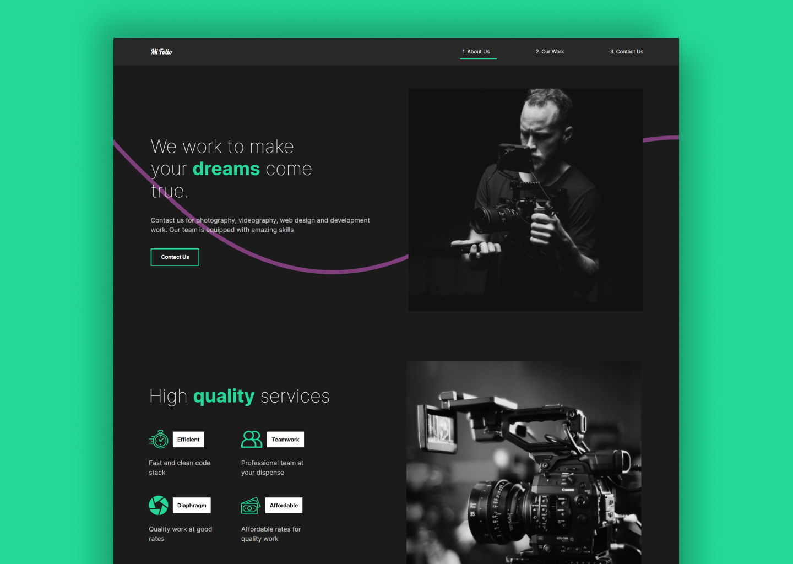

### MIfolio - React Portfolio with Framer

<br />
<p align="center">
  <a href="https://mifolio-react-app.vercel.app/">
    
  </a>

  <h3 align="center">Mifolio | Portfolio for Editors </h3>

  <p align="center">
Job Portfolio <br />
    <a href="m90khan@gmail.com"><strong>Contact Me</strong></a>
    <br />
    <br />
    <a href="https://mifolio-react-app.vercel.app/">View Demo</a>
    
   </p>
</p>

## Table of Contents

- [About the Project](#about-the-project)
- [Process](#process)
- [Skills](#skills)
- [Code Snipet](#code)
- [Connect with me](#Contact)

---

### About the Project

Live: https://mifolio-react-app.vercel.app/



#### Process

- Setup react environment with react-router.
- Implement the structure, divide it into components.
- Applied styling using styled-components.
- Add framer for an Animate Shared Layout effect besides svg and other animations.


---

### Skills

[][youtube]
[][youtube]
[][youtube]
[][youtube]
[][youtube]
[][youtube]

[][youtube]
[][youtube]
[][youtube]
<br />
<br />

---

### Code Snippet

```javascript
export const pageAnimation = {
  hidden: {
    opacity: 0,
    y: 300,
  },
  show: {
    opacity: 1,
    y: 0,
    transition: {
      duration: 1,
      when: 'beforeChildren',
      staggerChildren: 0.25,
    },
  },
  exit: {
    opacity: 0,
    y: 300,
    transition: {
      duration: 0.5,
    },
  },
};
```

---

### Connect with me:

[][youtube]

[][twitter]
[][linkedin]
[][instagram]
[][behance]
[][dribble]
<br />

---

[youtube]: https://www.youtube.com/channel/UC96rVfdTKsjZpREnH6CaCOw
[twitter]: https://twitter.com/uxdkhan
[linkedin]: https://www.linkedin.com/in/uxdkhan
[instagram]: https://www.instagram.com/uxdkhan/
[behance]: https://www.behance.net/Khan_Mohsin
[dribble]: https://dribbble.com/uxdkhan
